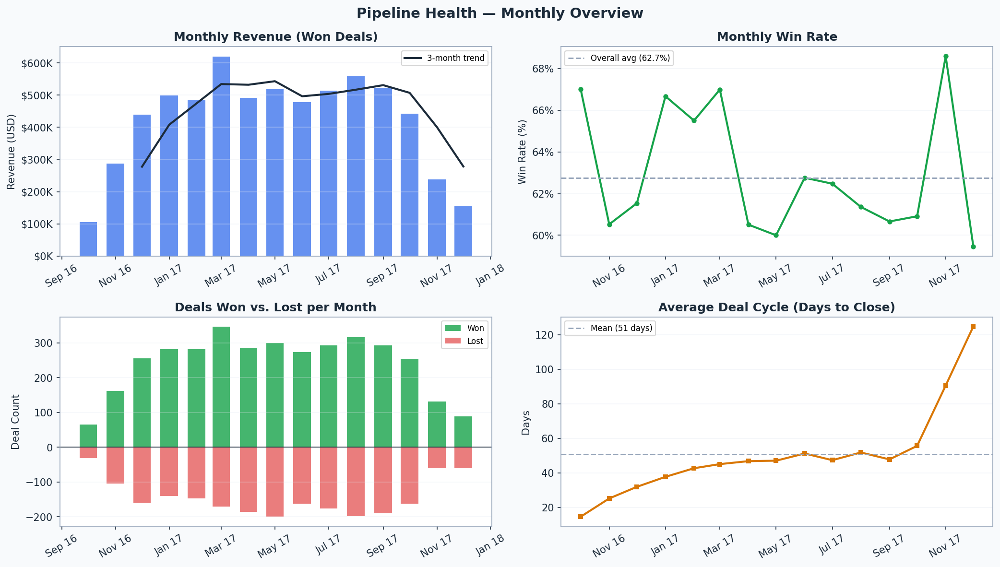
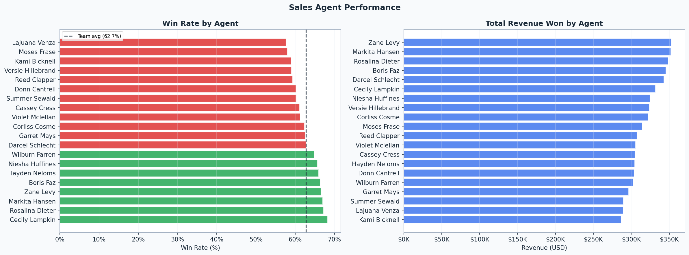
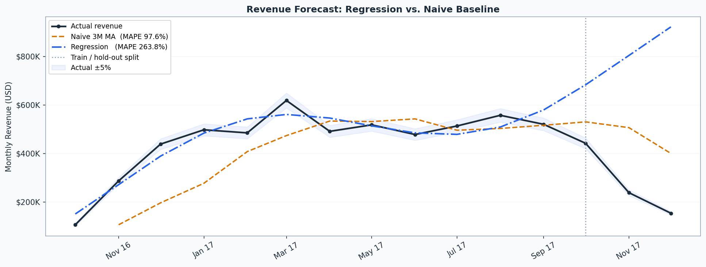
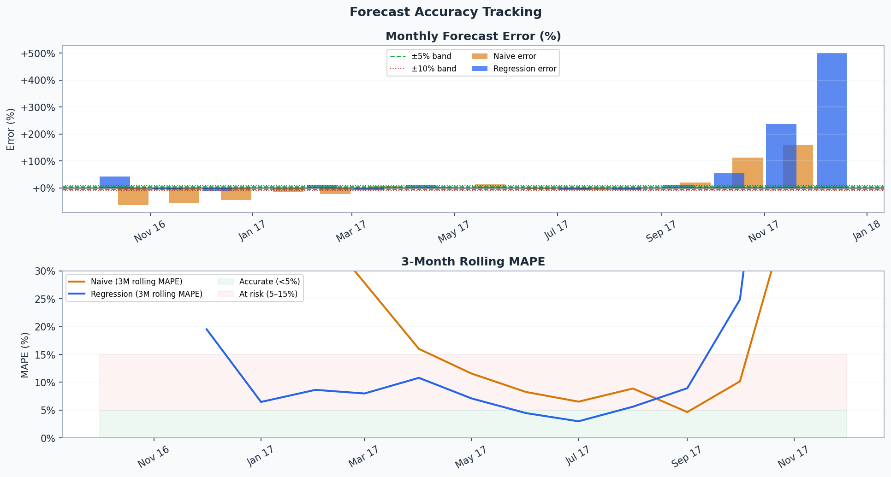
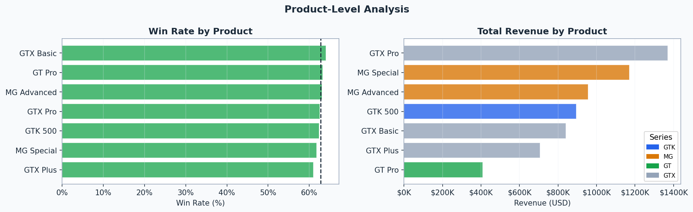
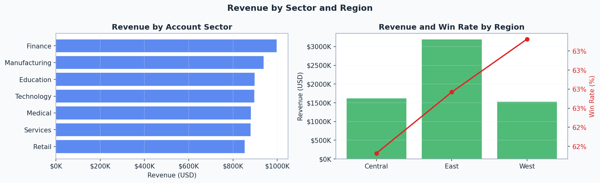

# CRM Sales Analysis

**Author:** Bora Çakır  
**Dataset:** CRM Sales Opportunities — [Maven Analytics](https://mavenanalytics.io/data-playground)

End-to-end revenue operations analysis built in Python and SQL on a real B2B sales pipeline dataset — 8,800 deal records across agents, products, accounts, and pipeline stages.

---

## What this covers

| Section | Description |
|---|---|
| Data ingestion | Fetches 4 CSV tables from a public mirror; falls back to a local reconstruction if offline |
| SQL exploration | SQLite queries for stage distribution, manager performance, product metrics, top accounts |
| Pipeline health | Monthly revenue, win rate, deal volume, and average sales cycle |
| Agent & product KPIs | Win rate and revenue broken down by agent and product series |
| Revenue forecasting | Naive 3-month MA vs. regression model with trend and seasonality features |
| Lagged pipeline feature | Adds prior-month pipeline volume as a leading indicator; compares MAPE improvement |
| Forecast accuracy | Monthly error tracking and rolling MAPE for both models |
| Deal scoring | Gradient Boosting classifier scoring open deals by close probability (leak-free features only) |
| Bottom-up forecast | Agent win rate × stage weight × list price, rolled up to manager and team level |
| DuckDB layer | Persists all tables to a `.duckdb` file; runs window functions not available in SQLite |
| Regional & sector | Revenue and win rate by office region and account industry |

---

## Charts

<p align="center">
  
  <br><em>Pipeline health — monthly revenue, win rate, deal volume, cycle length</em>
</p>

<p align="center">
  
  <br><em>Win rate and revenue by sales agent</em>
</p>

<p align="center">
  
  <br><em>Revenue forecast: regression model vs. naive baseline</em>
</p>

<p align="center">
  
  <br><em>Monthly forecast error and 3-month rolling MAPE</em>
</p>

<p align="center">
  
  <br><em>Win rate and revenue by product</em>
</p>

<p align="center">
  
  <br><em>Revenue and win rate by region</em>
</p>

---

## Setup

```bash
git clone https://github.com/TheEmeraldAgent/crm-sales-analysis.git
cd crm-sales-analysis
pip install -r requirements.txt
jupyter notebook revops_pipeline_analysis.ipynb
```

The notebook fetches the dataset automatically on first run. If you prefer to work offline, download the four CSVs from [Maven Analytics](https://mavenanalytics.io/data-playground) or the [Kaggle mirror](https://www.kaggle.com/datasets/innocentmfa/crm-sales-opportunities), place them in the root folder, and update the paths in the ingestion cell.

---

## Requirements

```
pandas
numpy
matplotlib
scikit-learn
duckdb
jupyter
```

---

## Dataset

**CRM Sales Opportunities** — Maven Analytics  
4 tables: `sales_pipeline`, `accounts`, `products`, `sales_teams`  
8,800 pipeline records · 85 accounts · 7 products · 20 agents · 6 managers  
Period: Oct 2016 – Dec 2017

---

## Repo structure

```
crm-sales-analysis/
├── revops_pipeline_analysis.ipynb
├── requirements.txt
├── README.md
└── charts/
    ├── pipeline_health.png
    ├── agent_performance.png
    ├── revenue_forecast.png
    ├── forecast_accuracy.png
    ├── product_analysis.png
    └── regional_analysis.png
```
